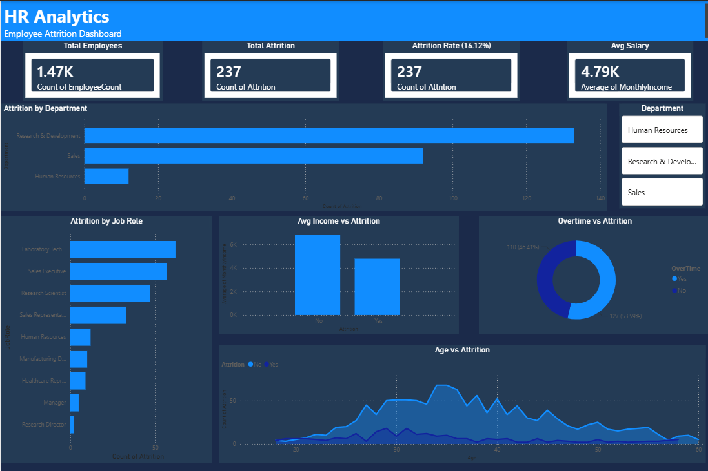

# HR Analytics — Employee Attrition Analysis

## Project Overview
Analyzed IBM HR dataset of 1,470 employees using Python 
and Power BI to identify key drivers of employee attrition 
and provide actionable retention recommendations.

## Tools Used
- **Python** — Exploratory Data Analysis (EDA)
- **Pandas** — Data manipulation
- **Matplotlib & Seaborn** — Data visualization
- **Power BI** — Interactive dashboard
- **Dataset** — [IBM HR Analytics Dataset — Kaggle](https://www.kaggle.com/datasets/pavansubhasht/ibm-hr-analytics-attrition-dataset)

## Business Questions Answered
1. What is the overall attrition rate?
2. Which department has highest attrition?
3. Does age affect attrition?
4. Does salary affect attrition?
5. Does overtime affect attrition?
6. Which job role has highest attrition?
7. Does work life balance affect attrition?
8. How does years at company affect attrition?

## Key Findings
- Overall attrition rate is **16.12%** — above industry benchmark
- **Sales Representatives** have highest attrition at **39.76%**
- Employees working **overtime are 3x more likely to leave** (30.53% vs 10.44%)
- Employees who left earned **$2,045/month less** than those who stayed
- **Most attrition happens within first 3 years**
- Younger employees **under 30** leave the most

## Recommendations
1. Review overtime policies — reduce mandatory overtime
2. Increase salary for Sales and Lab Technician roles
3. Build stronger onboarding for first 3 year employees
4. Create career growth programs for employees under 30
5. Improve work life balance initiatives

## Dashboard Features
- KPI Cards — Total Employees, Total Attrition, Attrition Rate, Avg Salary
- Attrition by Department
- Overtime vs Attrition
- Attrition by Job Role
- Avg Income vs Attrition
- Age vs Attrition
- Interactive Department Slicer

## Dataset
- Source: [IBM HR Analytics — Kaggle](https://www.kaggle.com/datasets/pavansubhasht/ibm-hr-analytics-attrition-dataset)
- Records: 1,470 employees
- Columns: 35 features
- Target: Attrition (Yes/No)
